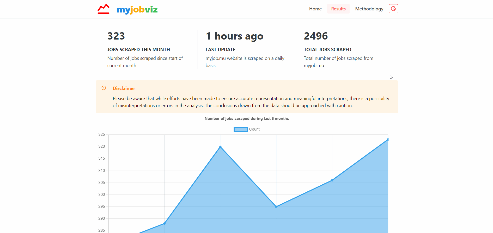

# myjobviz  

  

Visualize the latest job trends in the IT job market in Mauritius. 

[▶ Live preview](myjobviz.web.app)

# How it works
1. A selenium web scraper fetches new jobs from myjob.mu on a daily basis.
2. Scraped data is processed and saved to Firestore database.
3. `myjobviz` website fetches processed data from Firestore and creates charts.
# Usage

View instructions on how to setup the project locally [here](docs/setup.md).

# Disclaimer

Please be aware that while efforts have been made to ensure accurate representation and meaningful interpretations, there is a possibility of misinterpretations or errors in the analysis. The conclusions drawn from the data should be approached with caution.

# To-do 
* [ ] Add a workflow to backup database (and maybe release a public version).
* [ ] Add more tests using test sample data.
* [ ] Add workflow to check for duplicates.
* [ ] Frontend
  + [ ] Add a choropleth map
  + [ ] Add [offline support](https://firebase.google.com/docs/firestore/manage-data/enable-offline#web-modular-api)
* [ ] Use typescript on frontend
* [ ] Generate charts on backend
# Acknowledgements

## Before deploying

* [ ] Update service account key on Github
* [ ] Update social preview
* [ ] Deploy only frontend on firebase 
* [ ] Disable github pages
* [ ] Update repo tags
# Release notes v1.0.0

## Changes

* Repository name changed from `mauritius-tech-job-statistics` to `myjobviz`.
* A complete rewrite of the the previous code.
  + Restructured entire project
  + Added type checking and docstrings to backend code
  + Reduced the number of dependencies for scraper. `beautifulsoup` is no longer required.
  + Improved tests
* Improved documentation.
* Project requires two databases instead of one.
* New website
  + Replaced old charts with interactive ones.
  + Responsive website
  + Added dark mode
  + Added new data visualizations
  + Hosted on Firestore instead of Github Pages
* Discontinued choropleth map visualisation temporarily. 
* Backup - data scraped is backed up to Google Drive in csv/json format automatically every month
