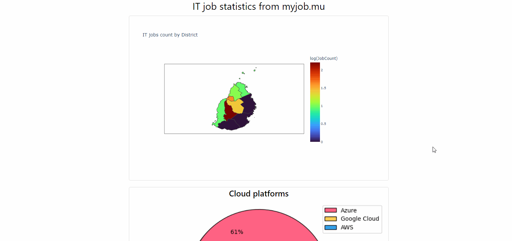

# myjobviz  

  

Visualize the latest job trends in the IT job market in Mauritius. 

[▶ Live preview](https://creme332.github.io/mauritius-tech-job-statistics/dist/)

# How it works
1. A selenium web scraper fetches new jobs from myjob.mu on a daily basis.
2. Scraped data is processed and saved to Firestore database.
3. `myjobviz` website fetches processed data from Firestore and creates charts.
# Usage

View instructions on how to setup the project locally [here](docs/setup.md).

# To-do 
* [ ] Automatically check for duplicates.
* [ ] Get rid of bs4 and use selenium only
* [ ] Frontend
  + [ ] Setup typescript for frontend
  + [ ] Use data from local storage while data is being fetched
  + [ ] Add timeseries data viz.
* [ ] Add a workflow to backup database (and maybe release a public version).
