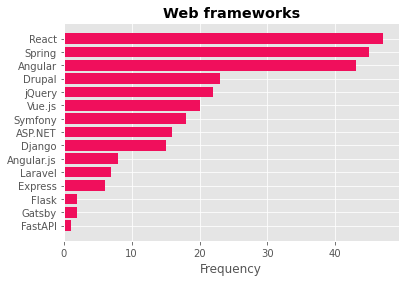
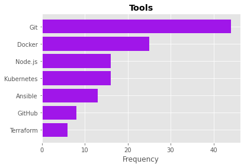

# 🇲🇺 Job Portal Web Scraper & Visualiser   #

Inspired by the Stack Overflow Developer Survey, the goal of this scraper is to analyse the trend in technologies in Mauritius.

In the span of $2$ months (1 May 2022 - 1 July 2022), $600$ unique **IT** job listings were scraped from [myjob.mu](https://www.myjob.mu/) using Python and BeautifulSoup library. The result was saved to a CSV file. Specific data (programming languages, databases, ...) from each job description were extracted. `MatlPlotLib` and `Plotly` were used to visualise the filtered data.

> ⚠️ **Interpret the following charts at your own discretion, keeping in mind the sample size and methodology used.**
> 

> ⚠️ **The percentage represents the percentage of jobs mentioning a particular criteria as opposed to the percentage of all jobs**

> ⚠️ **Only around 100 job listings disclosed the salary**

Online interactive version : (coming soon)

# 🌠Resources used   #

[Tutorial on web scraping to CSV file](https://www.youtube.com/watch?v=RvCBzhhydNk&ab_channel=Pythonology)

[Interactive map](https://towardsdatascience.com/a-complete-guide-to-an-interactive-geographical-map-using-python-f4c5197e23e0) 

[Tutorial on how to create chloropeth map](https://www.youtube.com/watch?v=aJmaw3QKMvk&ab_channel=IndianPythonista)

# 🔮 Future work  # 
- Collect data from more job websites
- Analyse how data varies with time
- Deploy interactive map on GitHub Pages
