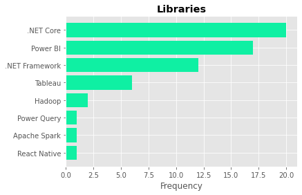
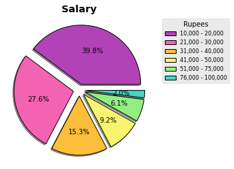

# To-Do #
- [ ] - Make images the same size on README
- [ ] Idea : Manually merge several charts in 1 image. Keep pdf version in folder.
- [ ] For all barcharts, keep distance between bars constant
- [ ] Add pie chart for job types
- [ ] Add word cloud
- [ ] Publish results on GitHub pages
- [ ] Search each language/framework on site to see if spelling matches expected spelling

# Table of contents #
1. [Introduction](#intro)
2. [Methodology](#Methodology)
   1. [Data collection](#collection)
   2. [Data analysis](#analysis)
3. [Results](#results)
   1. [Programming languages](#prog)
   2. [Web frameworks](#web)
   3. [Databases](#databases)
   4. [Other libraries](#libraries)
   5. [Other tools](#tools)
   6. [Salary](#salary)
5. [Resources used](#resources)
6. [Conclusion](#conclusion)
7. [Future work](#future) 

# 🇲🇺 Job Portal Web Scraper + Visualiser   #

Inspired by the Stack Overflow Developer Survey, the goal of this scraper is to analyse the trends in technologies in Mauritius.

#  ⚒️ Methodology   #

## 📝Data collection   ##
In the span of $2$ months (1 May 2022 - 1 July 2022), $600$ unique IT job listings were scraped from [myjob.mu](https://www.myjob.mu/) using the BeautifulSoup library. 
The result was saved to a CSV file.

More info here : 

## 🔎 Data analysis  ##
Specific data (programming languages, databases, ...) from each job description were extracted.

More info here : 

## 📈 Data visualisation ##
`MatlPlotLib` was used to visualise the filtered data.

`Plotly` was used to create the map.

# 📊 Results  #
> ⚠️ **Interpret the following charts at your own discretion, keeping in mind the sample size and methodology used.**
> 

## Programming languages  ## 

## Web frameworks  ## 

## Databases  ##

## Other libraries  ##

## Other tools  ##

## Job count  ##

## Operating systems  ##

## Cloud platforms  ##

## Salary  ##
> ⚠️ **Only m% of job listings disclosed the salary**

# 🌠Resources used   #

Tutorial on web scraping to CSV file : https://www.youtube.com/watch?v=RvCBzhhydNk&ab_channel=Pythonology

map of salary : https://towardsdatascience.com/a-complete-guide-to-an-interactive-geographical-map-using-python-f4c5197e23e0

Tutorial on how to create chloropeth map : https://www.youtube.com/watch?v=aJmaw3QKMvk&ab_channel=IndianPythonista

# 🔮 Future work  # 
- Collect data from more job websites
- Analyse how data varies with time
